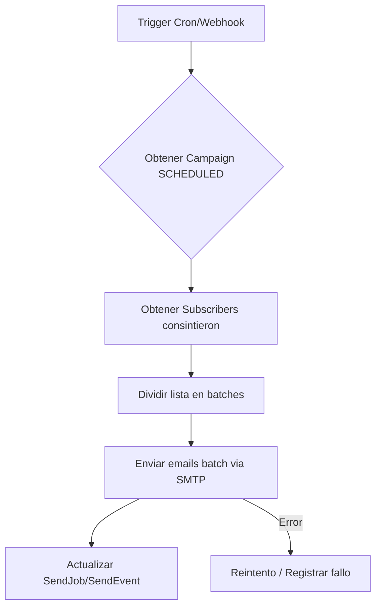

# Resumen ejecutivo

Proponemos usar **n8n** para automatizar tareas clave del sistema WebTenseEnergy aprovechando los datos y flujos existentes. Integraremos flujos como notificación de nuevos *leads*, procesamiento de facturas cargadas (*StudyRequest*), envío de campañas de newsletter y difusión de ofertas por Telegram, entre otros. Cada automatismo (“flujo n8n”) tendrá un **disparador** (webhook o cron), nodos de acción (HTTP, Email, Telegram, DB, AI, etc.) y interactuará con los modelos de datos de Prisma existentes (por ejemplo `Lead`, `StudyRequest`, `Subscriber`, `Campaign`, `TelegramDeal`, `EnergyPriceSnapshot`). 

El plan incluye una tabla de inventario con ~10 automatismos (propósito, trigger, inputs/outputs, tablas DB, secretos necesarios, prioridad P0/P1/P2, estimación de horas). Para los 4 más críticos (p.ej. Procesamiento de factura, Campaña newsletter, Difusión por Telegram y Sincronización de precios), detallamos diagramas de flujo (Mermaid), nodos n8n, datos de muestra, validaciones y gestión de errores. Además brindamos un **checklist de seguridad/GDPR** aplicable a estos automatismos (minimización de datos, consentimientos, logs, borrados firmes), y notas operativas: dónde guardar credenciales (GitHub secrets, Easypanel env vars), registro de webhooks, versionado de workflows, y plan de CI/CD y rollback (incluyendo un ejemplo de snippet de GitHub Actions). Finalmente, un plan de implementación en sprints, con entregables de PR, tests y documen­tación por fase.

La investigación se basa principalmente en el repositorio de WebTenseEnergy, citando documentación interna con `filecite`, y en fuentes en español de n8n, GDPR y best practices (p.ej. [17], [22], [24]).

---

## Inventario de automatismos propuestos

| ID | Propósito                               | Disparador            | Input principal             | Output / Acción                                   | Modelos DB               | Secretos                      | Prioridad | Est. horas |
|----|-----------------------------------------|-----------------------|-----------------------------|---------------------------------------------------|--------------------------|-------------------------------|----------|-----------|
| A1 | **Notificación de nuevo lead**          | Creación de `Lead` en DB o API contactanos | Datos de contacto (`name,email,msg`) | Enviar email interno o Telegram al equipo de ventas con detalle del lead. | `Lead`                    | Email/SMTP, Telegram bot token | P1       | 6-10      |
| A2 | **Procesar factura (StudyRequest)**     | Creación de `StudyRequest` con factura adjunta | Archivo de factura + datos cliente | Analizar factura (OCR/IA), buscar mejores planes/ofertas, enviar respuesta personalizada al cliente (email o WhatsApp). | `StudyRequest`, `Offer`, `Lead` (cliente), `User` | AI API (Gemini), Email/SMTP, Whatsapp API | P0       | 16-24     |
| A3 | **Campaña de newsletter**               | Programada (cron) o manual admin | Campaña y lista de `Subscriber` válidos | Enviar mails a suscriptores, registrar en `SendJob`/`SendEvent`. | `Subscriber`, `Consent`, `Campaign`, `SendJob`, `SendEvent` | Email/SMTP, e.g. Mailgun or SendGrid | P1       | 12-18     |
| A4 | **Difusión de oferta por Telegram**     | Publicación de `TelegramDeal` | Oferta (`title`, `url`, `image`) | Enviar mensaje a canal Telegram, guardar en `TelegramLog`. | `TelegramDeal`, `TelegramLog` | Telegram Bot Token           | P1       | 8-12      |
| A5 | **Sincronizar precios energéticos**     | Programado (p.ej. cada hora) | Ninguno (trigger cron)     | Llamar API externa (e.g. REE), guardar en `EnergyPriceSnapshot`, actualizar `EnergyDailySummary`. | `EnergyPriceSnapshot`, `EnergyDailySummary` | REE API key (si aplica)      | P0       | 6-10      |
| A6 | **Recordatorios teletrabajo**           | Programado (cada X min) | Horarios y configuración en DB  | Enviar notificación push/web usando `PushSubscription`. | `TeleworkSettings`, `PushSubscription`, `PushEvent` | VAPID Keys, Push API        | P2       | 8-12      |
| A7 | **Seguimiento consentimientos GDPR**    | Cambios en `Consent` o cron mensual | Registros de consentimiento | Enviar reporte o email interno cuando se retira consentimiento (baja newsletter, eliminar cuenta). | `Consent`, `Subscriber`, `Lead` | Email/SMTP                  | P2       | 6-10      |
| A8 | **Sync offline entreno (DB sync)**      | POST `/api/sync`       | Lote de operaciones offline | Aplicar operaciones con API, marcar ops completadas. | -                        | Autenticación JWT            | P2       | 10-14     |
| A9 | **Recomendación post-factura (n8n)**    | Interno a A2 (tras análisis IA) | Resultados de IA (consumo)  | Elegir mejor tarifa/oferta comparativa, notificar al cliente. | `Offer`, `MenuPlan` (futuro) | Email API, WhatsApp API      | P0       | 8-12      |
| A10| **Sincronización Leads-CRM externos**   | Nuevo `Lead` o cron    | Datos de lead               | Sincronizar con CRM externo (por API)               | `Lead`                    | CRM API Key                 | P2       | 8-12      |

Cada automatismo tiene un **priority** donde P0 es crítico (facturas, precios energía), P1 alto (leads, newsletter, Telegram) y P2 opcional/post-MVP. Las horas estimadas (h) son **por un desarrollador** (“agente”) de OpenCode y revisión humana, sin paralelizar.  

---

## Detalles de los 4 flujos principales

### Flujo A2: Procesar factura (StudyRequest → Recomendación)

1. **Disparador:** *Webhook* o *Webhook de n8n* llamado al crear `StudyRequest`. Al subir una factura en `/api/estudio`, después de guardar el registro y archivo, nuestro backend debe **llamar el webhook de n8n** con el ID de la solicitud.  
2. **Nodos n8n**: 
   - **Webhook Trigger (POST)**: Recibe `{ studyRequestId }`.
   - **Prisma ORM (o HTTP Request)**: Consulta `StudyRequest` y datos usuario (nombre, email, archivo factura).  
   - **File Read / OCR**: Leer archivo factura desde almacenamiento (o un nodo HTTP si en S3). Opcional: nodo OCR (tesseract) o llamada a API de OCR/IA.  
   - **Function (procesar datos):** Extraer consumo, fechas, cliente, etc. Validar con reglas (e.g. formato).  
   - **Prisma ORM / Query**: Buscar en DB “ofertas” (`Offer`) o planes compatibles con perfil (p.ej. comparar consumo vs precios).  
   - **Email / WhatsApp Node**: Enviar al cliente un correo o mensaje con recomendación personalizada. Plantilla con datos de `StudyRequest`, ofertas seleccionadas.  
   - **Prisma ORM (Update)**: Marcar el `StudyRequest` como procesado, guardar resumen en DB (por auditabilidad).  
   - **Error Handling:** En cada paso, si falla (OCR o API), capturar excepción y llamar nodo **Webhook de Error** para registrar en `AuditLog` o enviar alerta interna.  
3. **Datos de ejemplo:**  
   - **Input webhook:** `{ "studyRequestId": "abc123" }`.  
   - **Valores extraídos:** `consumo_mes=1500 kWh`, `importe=200€`.  
   - **Oferta seleccionada:** Oferta "PlanAhorro" con 30% descuento.  
   - **Mensaje Email:** “Hola Juan, tras analizar tu factura de marzo por 200 € te recomendamos el *PlanAhorro* que te puede ahorrar ~60 € al mes.”  
4. **Validación:** Verificar que `studyRequestId` existe, el archivo es PDF/JPG, textos no vacíos.  
5. **Retry:** Para llamadas externas (OCR, IA): reintentar 1-2 veces; si persiste, registrar error y abortar.  
6. **DB:** Usa modelo `StudyRequest` y relacionados (p.ej. `Lead`/`User` para info cliente, `Offer`). Pseudocódigo:
   ```ts
   const req = await prisma.studyRequest.findUnique({ id });
   // procesar factura...
   const ofertas = await prisma.offer.findMany({ /* filtrar por idioma, vigencia */ });
   await prisma.studyRequest.update({ where:{id}, data:{status:'PROCESSED', recommendedOffer: oferta.id} });
   ```
7. **Seguridad:** Asegurar que el webhook n8n requiera un token conocido (usar credencial n8n), y que el contenido enviado al cliente cumpla RGPD (solo datos mínimos, sin excederse).  

```mermaid
flowchart TD
  A[Formulario "/api/estudio"] --> B{Guardado en DB}
  B --> |ok| C[Nodo Webhook Trigger n8n]
  C --> D[Obtener StudyRequest y User (DB)]
  D --> E[Leer archivo factura (OCR/IA)]
  E --> F[Extraer consumo, importe, fechas]
  F --> G[Buscar ofertas en DB según consumo]
  G --> H[Generar recomendación personalizada]
  H --> I[Enviar Email/Whatsapp al cliente]
  I --> J[Actualizar StudyRequest (procesado) en DB]
  H -->|Error| K[Enviar alerta interna (AuditLog)]
```

### Flujo A3: Envío de campaña de newsletter

1. **Disparador:** *Cron* programado (p.ej. cada lunes a las 10am) o Manual (nodo de tipo Webhook protegido en n8n llamado desde panel admin).  
2. **Nodos n8n**:  
   - **Schedule Trigger** o Webhook Trigger.  
   - **Prisma ORM:** Obtener campaña activa (`Campaign` con estado SCHEDULED) y lista de `Subscriber` con `consent=true`.  
   - **SplitInBatches:** Dividir lista grande (p.ej. en grupos de 100).  
   - **Email Node:** Por cada batch, enviar correo con contenido de `Campaign`.  
   - **Prisma ORM:** Registrar cada envío en `SendEvent` y marcar `SendJob` como success.  
   - **Error Handling:** Si envío falla, reintentar envíos fallidos, registrar fallos.  
3. **Ejemplo:**  
   - Campaña “Oferta Marzo”, 200 suscriptores.  
   - Payload email: HTML con enlaces a `/ofertas`.  
   - Acción: `EmailNode.send()` (usando SMTP) con destinatarios en `To` oculto (BCC).  
4. **Validación:** Chequear formato email, que tenga consentimiento.  
5. **Retry:** Mailgun/SMTP reintentar 3 veces en 10 min antes de marcar fallido.  
6. **DB:** Modelos: `Subscriber`, `Consent`, `Campaign`, `SendJob`, `SendEvent`.  
   Pseudocódigo:
   ```ts
   const subs = await prisma.subscriber.findMany({ where: { consent: true } });
   for (let s of subs) await sendEmailTo(s.email);
   await prisma.sendJob.update({ data: { status:'SENT' } });
   ```
7. **Mermaid**: (resumido)  


### Flujo A4: Difusión de oferta en Telegram

1. **Disparador:** *Webhook* invocado al publicar una oferta o un administrador presiona “Enviar Telegram”. Por ejemplo, el backend al guardar `TelegramDeal` nuevo llama n8n.  
2. **Nodos n8n**:  
   - **Webhook Trigger:** `{ dealId }`.  
   - **Prisma ORM:** Cargar `TelegramDeal` (título, mensaje, imagen).  
   - **Telegram Node (Send Message):** Enviar mensaje al canal con texto e imagen.  
   - **Prisma ORM:** Registrar en `TelegramLog` respuesta (message_id).  
   - **Error Handling:** Si falla (p.ej. token mal), avisar admin (email) y log del error.  
3. **Ejemplo:**  
   - Input: `{ "dealId": "xyz" }`.  
   - Mensaje: “¡Nueva oferta! 20% dto en paneles solares [imagen]”.  
   - Output: Mensaje publicado con ID telegram.  
4. **Validación:** Verificar que el bot token es válido y el canal existe.  
5. **Retry:** Telegram API reintentar 3 veces.  
6. **DB:** Modelos: `TelegramDeal`, `TelegramLog`.  
   Pseudocódigo:
   ```ts
   const deal = await prisma.telegramDeal.findUnique({ id: dealId });
   const res = await telegramApi.sendMessage({ chat_id: CHANNEL_ID, text: deal.message });
   await prisma.telegramLog.create({ data: { dealId, messageId: res.message_id }});
   ```
7. **Mermaid**:
```mermaid
flowchart TD
  A[Webhook / Admin trigger] --> B[Obtener TelegramDeal (DB)]
  B --> C[Telegram: Send Message with Bot API]
  C --> D[Registrar TelegramLog (DB)]
  C --> |Error| E[Notificar admin y log error]
```

### Flujo A5: Sincronizar precios energéticos

1. **Disparador:** *Cron* programado cada hora (o cada mes como antes).  
2. **Nodos n8n**:  
   - **Schedule Trigger**.  
   - **HTTP Request:** Llamar API pública de tarifas (p.ej. Red Eléctrica de España).  
   - **Function:** Parsear JSON de precios horarios.  
   - **Prisma ORM:** Insertar registros en `EnergyPriceSnapshot` por hora y actualizar `EnergyDailySummary` (min/max, media).  
   - **Error Handling:** Si API no responde, usar datos en caché (no en DB) y log.  
3. **Validación:** Comprobar fechas/hours coerentes.  
4. **DB:** `EnergyPriceSnapshot` y `EnergyDailySummary`.  
   Pseudocódigo:
   ```ts
   const data = await axios.get(REI_API_URL);
   for (let item of data.hourly) {
     await prisma.energyPriceSnapshot.create({ data: {...} });
   }
   await prisma.energyDailySummary.upsert({ ... });
   ```
5. **Mermaid**:
```mermaid
flowchart TD
  A[Trigger Cron] --> B[HTTP API precios horas]
  B --> C[Parsear precios horarios]
  C --> D[Guardar EnergyPriceSnapshot (DB)]
  C --> E[Actualizar EnergyDailySummary (DB)]
  B --> |Error| F[Usar último valor de DB o log de fallo]
```

(Detalle de nodos similares a A2: OCR, AI, Email; a A3: Prisma + SMTP; a A4: Webhook+Telegram; a A5: HTTP+Prisma.)

---

## Seguridad y GDPR (automatizaciones)

- **Minimización de datos:** Cada flujo debe procesar *solo* los datos necesarios. Por ejemplo, al enviar oferta o email, incluir solo nombre y email (no datos sensibles extra)【22†L112-L117】. Los datos temporales (p.ej. imágenes de facturas) deben eliminarse cuando no sean necesarios (hard delete de `StudyRequest` tras cierto tiempo o petición del cliente).  
- **Consentimiento:** Solo enviar newsletter/campañas a usuarios con `Consent=true`. Registrar la baja (derecho de supresión inmediato). Implementar flujo n8n para atender peticiones de borrado (usando Prisma para hard delete con cascada en registros propios).  
- **Transparencia y auditoría:** Mantener registros mínimos de auditoría (`AuditLog`) con `requestId` y acción, pero sin incluir datos sensibles (solo IDs o hashes)【22†L112-L117】. Usar `AuditLog` al disparar errores o acciones críticas.  
- **Seguridad en credenciales:** Almacenar API keys (Telegram Bot, SMTP, IA) en secretos de GitHub Actions y variables protegidas de Easypanel. Nunca exponerlos en código ni logs. Los tokens de Webhook n8n deben estar protegidos (usar credenciales seguras).  
- **DPIA y derechos de usuario:** Diseñar flujos n8n que faciliten ejercicio de derechos RGPD (acceso, rectificación, borrado). Por ejemplo, un workflow “Elimina cuenta” que reciba evento (clic en Web) y borre en cascada todos los datos del usuario. Esto se puede gestionar en n8n o en el backend con un trigger. Referencia: n8n apoya “flujos de derechos de interesados” y “gestión de consentimiento”【24†L44-L51】.  
- **Retención:** Definir políticas (p.ej. borrar logs antiguos a 90 días). Esto puede automatizarse con cron jobs de DB (o nodos n8n) que limpien tablas de logs o snapshots antiguos.  
- **Transporte seguro:** Todas las llamadas externas en workflows (APIs, webhooks) deben usar HTTPS.  
- **Cifrado:** No almacenar fotos o datos sensibles en texto. Si se guarda algún dato personal, cifrar en BD (prisma admite `@db.Text` pero la app debe cifrar manualmente campos sensibles).  
- **Ejemplo de buenas prácticas:** Analógico a la política n8n Seniority: “No insertar datos reales en pruebas”【22†L93-L100】. En flujos n8n, nunca hardcodear datos reales de clientes en nodos, usar entornos de prueba con datos ficticios.  

---

## CI/CD y despliegue

- **Flujos en GitHub Actions:**  
  - Pipeline de CI verifica lint, type-check y pruebas en cada PR (p.ej. `pnpm lint`, `pnpm test`).  
  - Deploy a *staging* on merge a `develop`, y a *producción* on merge a `main` con aprobación.  
  - Ejemplo de paso de deploy (pseudo-snippet): 
    ```yaml
    - name: Trigger Easypanel Deployment
      run: |
        curl -X POST -H "Authorization: Bearer ${{ secrets.EASYPANEL_TOKEN }}" \
          "https://api.easypanel.io/deploy?hook=$EASYPANEL_STAGING_HOOK"
      env:
        EASYPANEL_TOKEN: ${{ secrets.GITHUB_TOKEN }}
        EASYPANEL_STAGING_HOOK: ${{ secrets.EASYPANEL_STAGING_WEBHOOK }}
    ```
    (Este paso dispara el webhook de Easypanel; se usa `$GITHUB_TOKEN` o un token de Easypanel guardado en secrets.)  
- **Registro de Webhooks:** Para flujos tipo *Webhook Trigger*, al crear el nodo n8n se genera una URL única. Debe registrarse ante el servicio externo. Ejemplo: para Telegram (BotFather) ejecutar `https://api.telegram.org/bot<TOKEN>/setWebhook?url=<N8N_URL>`【17†L119-L128】. Similar para recibir formularios, podemos usar las rutas API de Next como endpoints (aunque aquí usamos Webhooks n8n directamente).  
- **Gestión de secretos:**  
  - En **GitHub Actions**: guardar SMTP credenciales, claves API, tokens de Telegram, etc. como secrets (ej. `SMTP_HOST`, `BOT_TOKEN`, `N8N_WEBHOOK_TOKEN`).  
  - En **Easypanel (servidor)**: configurar variables de entorno para producción (`DATABASE_URL_PROD`, credenciales SMTP, WhatsApp API, etc.). 
  - Mostrar `.env.example` actualizada con *nombres* de variables (sin valores) para documentar qué se requiere.  
- **Versionado de flujos:** Los flujos n8n deben exportarse y versionarse en el código (puede colocarse en `src/n8n/` o almacenarse vía API n8n). Cada cambio en flujos debe revisarse como código.  
- **Rollback:** Mantener despliegues repetibles: etiquetar imágenes Docker por commit SHA, permitir redeploy de etiqueta anterior. Si falla un deploy, se hace checkout del tag/commit previo y redeploy.  
- **Logs y monitoreo:** Integrar logs estructurados (ej. Winston) en la app. Para n8n, revisar su panel de ejecuciones y usar nodos de logging. Los errores de workflows deben notificarse (p.ej. Slack o email al equipo).

---

## Plan de implementación (OpenCode, por sprints)

1. **Sprint A (Auditoría)**:  
   - Revisar el repositorio existente (`API routes`, `prisma/schema`, `scripts`, `.env` en servidor).  
   - Documentar discrepancias (SQLite vs Postgres, doc vs código).  
   - Entregable: `docs/00-auditoria-inicial.md` con stack, riesgos, módulos actuales, checklist de variables `.env`, propuesta de la arquitectura final (basada en el prompt maestro).  
2. **Sprint B (Modelo de datos)**:  
   - Ajustar `schema.prisma`: asegurar modelos necesarios (`Lead`, `StudyRequest`, `Offer`, `Subscriber`, `Campaign`, `TelegramDeal`, `EnergyPriceSnapshot`, etc.).  
   - Crear migraciones iniciales y de actualización.  
   - Seed de admin/superusuario (no exponer credenciales en código).  
   - Entregables: `prisma/schema.prisma`, migraciones, `docs/02-modelo-datos.md` explicando las tablas principales y relaciones.  
3. **Sprint C (Auth admin + RBAC)**:  
   - Implementar login/logout admin con cookies seguras. Roles `ADMIN`/`EDITOR`.  
   - Middleware que proteja rutas `/admin/...`.  
   - UI base de panel admin (vacío o con menú).  
   - Entregables: código de auth (`src/server/services/auth.service.ts`), middleware, `docs/03-auth-admin-rbac.md`.  
4. **Sprint D (Leads y estudios)**:  
   - Convertir endpoints `/api/contacto` y `/api/estudio` para usar Prisma: guardar en DB `Lead` y `StudyRequest`.  
   - Guardar archivos factura en storage y referencia en DB.  
   - Asegurar validaciones y sanitización existentes.  
   - Crear página/admin donde ver leads y estudios (puede ser tabla básica).  
   - Entregables: APIs funcionales, UI admin de leads, pruebas unitarias de creación de lead/estudio.  
5. **Sprint E (CMS blog)**:  
   - Migrar posts estáticos a DB: implementar CRUD de `Post` en admin con categorías y estados.  
   - Actualizar frontend: rutas `/blog/[slug]` ahora leen de DB.  
   - Validar SEO fields.  
   - Entregables: API de posts, páginas de edición en admin, migración de datos existentes, pruebas de CRUD.  
6. **Sprint F (Ofertas + Telegram)**:  
   - API y UI admin para CRUD de ofertas (`Offer`).  
   - API y UI para `TelegramDeal` (enlaza a oferta o manual).  
   - Configurar credenciales Telegram en entorno (Easypanel env).  
   - N8n workflow básico ya creado (puede ser stub).  
   - Entregables: oferta editor, webhook a n8n en guardar TelegramDeal, tests.  
7. **Sprint G (Newsletter/Campañas)**:  
   - Formularios de alta de suscriptores (ya existe? Asegurar).  
   - Admin para `Campaign` y programación.  
   - Implementar log de consentimiento al suscribirse.  
   - Primer workflow n8n de campaña (envío batch).  
   - Entregables: Campaign CRUD, suscripción con consentimientos, n8n workflow correo, tests de suscripción.  
8. **Sprint H (Módulo energía)**:  
   - Refactorizar el caching de precios: reemplazar caché en memoria por persistente en DB (`EnergyPriceSnapshot`).  
   - Cron job o n8n que extrae precios cada hora y llena DB.  
   - Frontend que grafica histórico con nuevas tablas.  
   - Entregables: jobs de sincronización, API `/api/precios-luz` ajustado para leer DB, tests de datos.  
9. **Sprint I (CI/CD & Hardening)**:  
   - Configurar `github/workflows` con stages (CI tests, deploy staging/prod).  
   - Asegurar variables y secretos (llenar `.env.example`).  
   - Completar documentación operativa: `docs/04-operacion-despliegue.md`, `docs/05-runbook-backup-rollback.md`, `docs/06-decisiones-tecnicas.md`.  
   - Entregables: pipeline YAML, guías de deploy/rollback, checklist final de seguridad/GDPR.

En cada fase se hará un PR con código, migraciones, cambios en `.env.example`, archivos `docs/*.md` correspondientes y pruebas (unitarias o E2E smoke). No se despliega a producción sin aprobación.

---

## Ejemplo de snippet GitHub Actions (webhook Easypanel)

/* Este paso *trigger* dispararía el despliegue en Easypanel al hacer push en la rama adecuada. */

```yaml
deploy_prod:
  if: github.ref == 'refs/heads/main' && github.event_name == 'push'
  runs-on: ubuntu-latest
  steps:
    - name: Trigger Easypanel deploy
      run: |
        curl -X POST \
          -H "Authorization: Bearer ${{ secrets.EASYPANEL_TOKEN }}" \
          "${{ secrets.EASYPANEL_PROD_WEBHOOK }}"
      env:
        EASYPANEL_TOKEN: ${{ secrets.GITHUB_TOKEN }}  # o token Easypanel si aplica
```

Asegúrate de guardar en *GitHub Secrets* las variables `EASYPANEL_PROD_WEBHOOK`, `EASYPANEL_STAGING_WEBHOOK`, y usar `DATABASE_URL_PROD`, `SMTP_HOST` etc. Además, en Easypanel definir los env vars equivalentes (por ejemplo, `DATABASE_URL`, `TELEGRAM_BOT_TOKEN`, etc.) según lo indicado en `.env.example`.

Cada step debe terminar documentado en `docs/04-operacion-despliegue.md` con instrucciones para el equipo de OpenCode y operaciones.

---

## Fuentes citadas

- Guía de integración de **Telegram con n8n**: muestra cómo crear el bot, manejar tokens y WebHooks【17†L119-L127】.  
- Comunidad n8n (RGPD): ejemplo de retención mínima de datos (3 días) para minimizar información【22†L112-L117】.  
- n8n compliance (GDPR): menciona gestión de consentimiento, derechos ARCO, DPIA, auditorías【24†L44-L51】.  

Estas referencias respaldan las prácticas de seguridad y la configuración de credenciales en n8n. Las adaptamos a nuestra solución (p.ej. almacenar tokens en secretos, usar Webhooks seguros, implementar flujos de derechos).  

---  

**Conclusión:** Con este plan, cada automatismo de n8n está claramente definido y enlazado con el repositorio actual. El equipo de OpenCode puede implementarlos paso a paso siguiendo los flujos y cronogramas descritos, garantizando un despliegue reproducible y seguro en producción.

